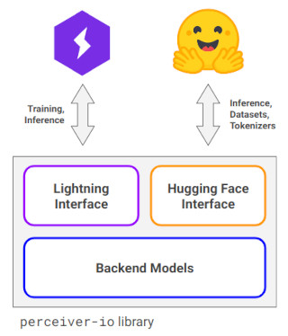

# Perceiver, Perceiver IO and Perceiver AR

This repository is a PyTorch implementation of Perceiver, Perceiver IO and Perceiver AR, with PyTorch Lightning
interfaces for model training and Hugging Face 🤗 interfaces for inference.

<table>
  <tr>
    <td>
       <b>Perceiver</b>: General Perception with Iterative Attention
       (<a href="https://arxiv.org/abs/2103.03206">paper</a>,
        <a href="https://www.youtube.com/watch?v=P_xeshTnPZg">video</a>)
    </td>
    <td></td>
  </tr>
  <tr>
    <td>
      <b>Perceiver IO</b>: A General Architecture for Structured Inputs & Outputs
      (<a href="https://arxiv.org/abs/2107.14795">paper</a>,
       <a href="https://www.deepmind.com/blog/building-architectures-that-can-handle-the-worlds-data">blog post</a>)
    </td>
    <td></td>
  </tr>
  <tr>
    <td>
      General-purpose, long-context autoregressive modeling with <b>Perceiver AR</b>
      (<a href="https://arxiv.org/abs/2202.07765">paper</a>,
       <a href="https://www.deepmind.com/blog/perceiver-ar-general-purpose-long-context-autoregressive-generation">blog post</a>)
    </td>
    <td></td>
  </tr>
</table>

## Overview

Core of the `perceiver-io` library are *backend models*, lightweight PyTorch implementations of Perceiver,
Perceiver IO and Perceiver AR. They can be wrapped into [PyTorch Lightning](https://pytorch-lightning.readthedocs.io/en/stable/)
modules for training (*Lightning interface*) and 🤗 modules for inference (*Hugging Face interface*). See
[library design](docs/library-design.md) for details.

<p align="center">
    
</p>

The command line interface for training is implemented with [Lightning CLI](https://pytorch-lightning.readthedocs.io/en/stable/cli/lightning_cli.html).
Training datasets are 🤗 [datasets](https://huggingface.co/docs/datasets) wrapped into PyTorch Lightning data modules.
For NLP tasks, `perceiver-io` supports all 🤗 [fast tokenizers](https://huggingface.co/docs/transformers/fast_tokenizers)
and the 🤗 Perceiver UTF-8 bytes tokenizer.

## Documentation

- [Installation](#installation)
- [Getting started](#getting-started)
- [Library design](docs/library-design.md)
- [Pretrained models](docs/pretrained-models.md)
- [Training examples](docs/training-examples.md)
- [Inference examples](examples/inference.ipynb) [](https://colab.research.google.com/github/krasserm/perceiver-io/blob/main/examples/inference.ipynb)
- [Model construction](docs/model-construction.md)
- [Building blocks](docs/building-blocks.md)

## Installation

### Via pip

```shell
pip install perceiver-io[text,vision]
```

### From sources

Installation from sources requires a [Miniconda](https://docs.conda.io/en/latest/miniconda.html) and a
[Poetry](https://python-poetry.org/docs/#installation) (1.2.0 or higher) installation.

Create and activate the `perceiver-io` conda environment:

```shell
conda env create -f environment.yml
conda activate perceiver-io
```

Install main and test dependencies, including all extras:

```shell
# Without dependencies required for examples
poetry install --all-extras
```

If you want to run the [examples](examples) locally, additionally use `--with examples`:

```shell
poetry install --all-extras --with examples
```

### Docker image

```shell
docker pull ghcr.io/krasserm/perceiver-io:latest
```

See [Docker image](docs/docker-image.md) for details.

## Getting started

### Inference

Compute the optical flow between consecutive frames of an input video and write the rendered results to an output
video:

```python
from urllib.request import urlretrieve
from transformers import pipeline

from perceiver.data.vision import video_utils
from perceiver.model.vision import optical_flow  # register auto-classes and pipeline

urlretrieve(
    url="https://martin-krasser.com/perceiver/flow/sintel_clip_cave_dragon_fight.mp4",
    filename="sintel_clip_cave_dragon_fight.mp4",
)

# Create optical flow pipeline
optical_flow_pipeline = pipeline("optical-flow", model="krasserm/perceiver-io-optical-flow", device="cuda:0")

# load consecutive video frame pairs
frame_pairs = video_utils.read_video_frame_pairs("sintel_clip_cave_dragon_fight.mp4")

# create and render optical flow for all frame pairs
optical_flows = optical_flow_pipeline(frame_pairs, render=True, device="cuda:0")

# create video with rendered optical flows
video_utils.write_video("sintel_clip_cave_dragon_fight_output.mp4", optical_flows, fps=24)
```

Here is a side-by-side comparison of the input and output video:

<p align="center">
    
</p>

See [inference examples](https://colab.research.google.com/github/krasserm/perceiver-io/blob/main/examples/inference.ipynb)
for more examples.

### Training

Train a small Perceiver IO image classifier (907K parameters) on MNIST from the command line. The classifier
cross-attends to individual pixels of input images with [repeated cross-attention](docs/building-blocks.md).
See [image classification](docs/training-examples.md#image-classification) training example for more details.

```shell
python -m perceiver.scripts.vision.image_classifier fit \
  --model.num_latents=32 \
  --model.num_latent_channels=128 \
  --model.encoder.num_frequency_bands=32 \
  --model.encoder.num_cross_attention_layers=2 \
  --model.encoder.num_self_attention_blocks=3 \
  --model.encoder.num_self_attention_layers_per_block=3 \
  --model.encoder.first_self_attention_block_shared=false \
  --model.encoder.dropout=0.1 \
  --model.encoder.init_scale=0.1 \
  --model.decoder.num_output_query_channels=128 \
  --model.decoder.dropout=0.1 \
  --model.decoder.init_scale=0.1 \
  --data=MNISTDataModule \
  --data.batch_size=64 \
  --optimizer=AdamW \
  --optimizer.lr=1e-3 \
  --lr_scheduler.warmup_steps=500 \
  --trainer.accelerator=gpu \
  --trainer.devices=1 \
  --trainer.max_epochs=30 \
  --trainer.logger=TensorBoardLogger \
  --trainer.logger.save_dir=logs \
  --trainer.logger.name=logs
```

[Model construction](docs/model-construction.md) describes how to implement model-specific command line interfaces
with the Lightning CLI. Training checkpoints are written to the `logs/img_clf/version_0/checkpoints` directory. Assuming
a checkpoint with filename `epoch=025-val_loss=0.065.ckpt` exists, it can be converted to a `perceiver-io` 🤗 model with

```python
from perceiver.model.vision.image_classifier import convert_mnist_classifier_checkpoint

convert_mnist_classifier_checkpoint(
    save_dir="example/mnist-classifier",
    ckpt_url="logs/img_clf/version_0/checkpoints/epoch=025-val_loss=0.065.ckpt",
)
```

so that it can be used in a 🤗 image classification pipeline

```python
from datasets import load_dataset
from transformers import pipeline

mnist_dataset = load_dataset("mnist", split="test")[:9]

images = mnist_dataset["image"]
labels = mnist_dataset["label"]

classifier = pipeline("image-classification", model="example/mnist-classifier")
predictions = [int(pred[0]["label"]) for pred in classifier(images)]

print(f"Labels:      {labels}")
print(f"Predictions: {predictions}")
```
```
Labels:      [7, 2, 1, 0, 4, 1, 4, 9, 5]
Predictions: [7, 2, 1, 0, 4, 1, 4, 9, 5]
```

or loaded directly:

```python
import torch
from transformers import AutoModelForImageClassification, AutoImageProcessor

model = AutoModelForImageClassification.from_pretrained("example/mnist-classifier")
processor = AutoImageProcessor.from_pretrained("example/mnist-classifier")

inputs = processor(images, return_tensors="pt")

with torch.no_grad():
    # use perceiver-io Hugging Face model
    output_1 = model(**inputs).logits

with torch.no_grad():
    # or use perceiver-io backend model directly  
    output_2 = model.backend_model(inputs.pixel_values)

print(f"Predictions: {output_1.argmax(dim=-1).numpy().tolist()}")
print(f"Predictions: {output_2.argmax(dim=-1).numpy().tolist()}")
```
```
Predictions: [7, 2, 1, 0, 4, 1, 4, 9, 5]
Predictions: [7, 2, 1, 0, 4, 1, 4, 9, 5]
```

See [training examples](docs/training-examples.md) for more examples.

## Articles

Articles referencing this repository:

- [Training compute-optimal Perceiver AR language models](https://krasserm.github.io/2023/01/23/scaling-perceiver-ar/)
- [A gentle introduction to Rotary Position Embedding](https://krasserm.github.io/2022/12/13/rotary-position-embedding/)

## Other implementations

- [Perceiver](https://paperswithcode.com/paper/perceiver-general-perception-with-iterative#code)
- [Perceiver IO](https://paperswithcode.com/paper/perceiver-io-a-general-architecture-for#code)
- [Perceiver AR](https://paperswithcode.com/paper/general-purpose-long-context-autoregressive#code)
