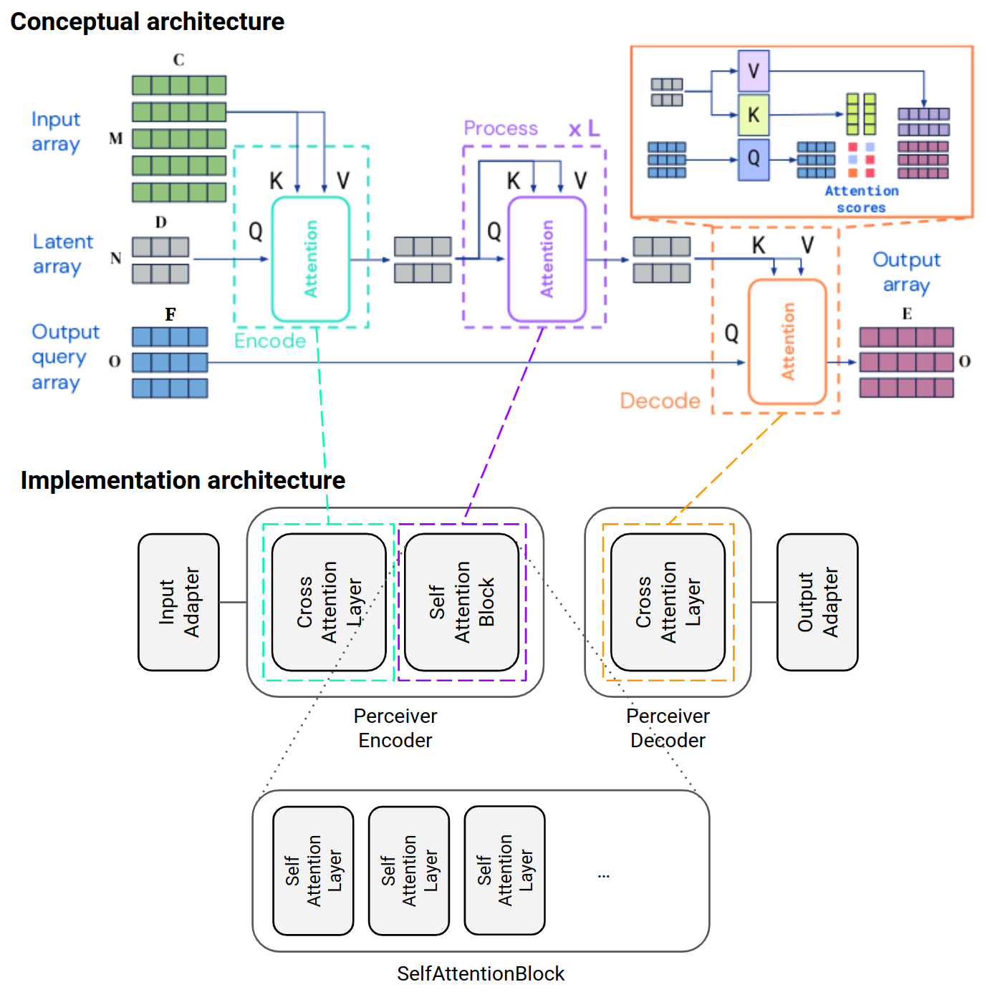
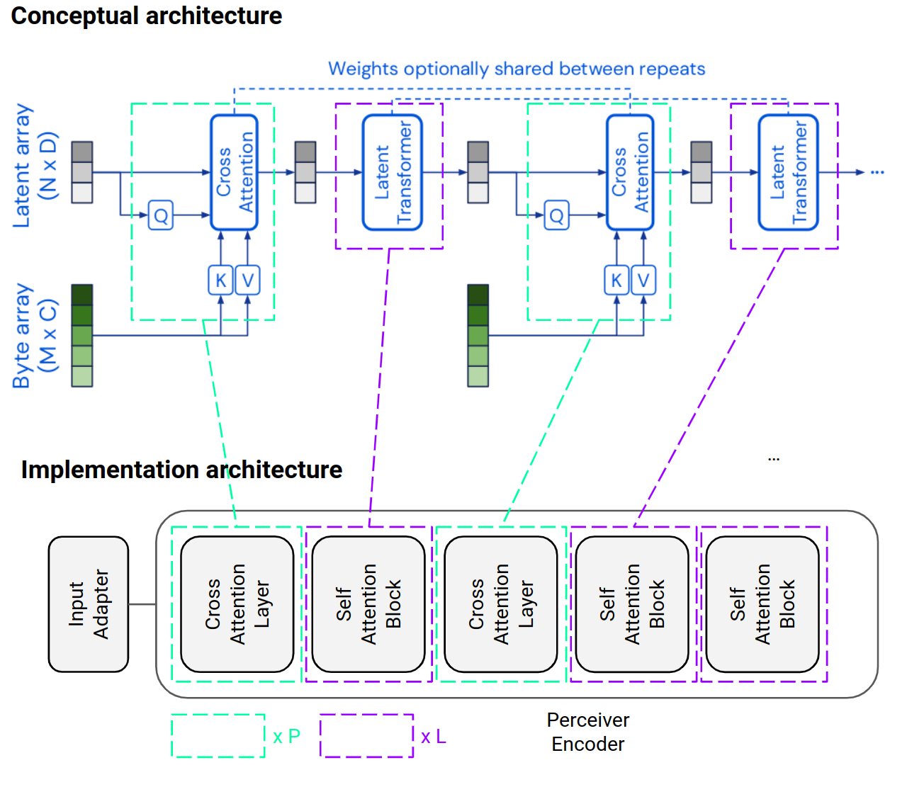

# Perceiver IO

This project is a PyTorch implementation of

- [Perceiver: General Perception with Iterative Attention](https://arxiv.org/abs/2103.03206) and
- [Perceiver IO: A General Architecture for Structured Inputs & Outputs](https://arxiv.org/abs/2107.14795)

and supports training of Perceiver and Perceiver IO models with [Pytorch Lightning](https://www.pytorchlightning.ai/)
at any scale.

- Section [Architecture](#architecture) explains how the architectures of Perceiver IO and Perceiver are implemented by
  this project.
- Section [Model API](#model-api) gives an example how a Perceiver IO model can be created and configured with the
  [PyTorch model API](#pytorch-model-api), the [PyTorch Lightning model API](#pytorch-lightning-model-api) and the
  [command line interface](#pytorch-lightning-model-cli).
- Section [Training examples](#training-examples) demonstrates how Perceiver IO models can be trained on some example
  tasks.
- Section [Inference examples](#inference-examples) links to notebooks that demonstrate how trained Perceiver IO
  models can be used for prediction.

## Installation

### From sources

```shell
conda env create -f environment.yml
conda activate perceiver-io
poetry install
```

### Via pip

```shell
pip install perceiver-io
```

When installing via `pip` make sure you have a CUDA toolkit installed as well (see also [environment.yml](environment.yml)).

## Architecture

The following sections describe how the conceptual architectures of Perceiver IO and Perceiver can be mapped to the
implementation provided by this project.

### Perceiver IO



Names of components shown in the implementation architecture are class names in the [PyTorch model API](#pytorch-model-api)
(see also [model.py](perceiver/model/model.py)). Task-specific input and output adapters are subclasses of `InputAdapter`
and `OuptutAdapter`, respectively (see also [adapter.py](perceiver/model/adapter.py)). Array dimensions (`M`, `C`),
(`N`, `D`), (`O`, `F`)  and (`O`, `E`) have the following names in code and/or on the command line:

| Array dimension | Configuration parameter name                                                    |
|-----------------|---------------------------------------------------------------------------------|
| `M`             | Input-specific name (e.g. `max_seq_len` for text input, ...)                    |
| `C`             | `num_input_channels` (property of `InputAdapter`)                               |
| `N`             | `num_latents`                                                                   |
| `D`             | `num_latent_channels`                                                           |
| `O`             | Output-specific name (e.g. `num_output_queries` for classification output, ...) |
| `E`             | Output-specific name (e.g. `num_classes` for classification output, ...)        |
| `F`             | `num_output_query_channels` (property of `OutputAdapter`)                       |

The number of layers in a `SelfAttentionBlock` can be specified with `num_self_attention_layers_per_block` and the
number of blocks with `num_self_attention_blocks` (`L` in the conceptual architecture). Self-attention blocks share
their weights.

### Perceiver

Perceiver IO does **not** use repeated encoder cross-attention as described the [Perceiver IO](https://arxiv.org/abs/2107.14795)
paper:

> We omit the repeated encoder cross-attends used in [Perceiver](https://arxiv.org/abs/2103.03206) as we found these to lead to relatively small performance
> improvements but to significantly slow down training ...

This may be the case for the very large datasets used in the Perceiver IO paper but I found that repeated encoder
cross-attention actually gives much better training results for smaller datasets. Therefore, the implementation
provided by this project supports repeated encoder cross-attention.



The number of repeated cross-attentions can be specified with `num_cross_attention_layers` (`P`) which must be less than
or equal `num_self_attention_blocks` (`L`). Cross-attention layers 2 - `P` and self-attention blocks 2 - `L` always share
their weights. Sharing the weights with the first cross-attention layer can be controlled with `first_cross_attention_layer_shared`,
sharing the weights with the first self-attention block can be controlled with `first_self_attention_block_shared`. The
default values of these hyperparameters are consistent with the Perceiver IO architecture (1 cross-attention layer, `L`
self-attention blocks with weight sharing).

## Model API

### PyTorch model API

The PyTorch model API is based on generic encoder and decoder classes (`PerceiverEncoder` and `PerceiverDecoder`) and
task-specific input and output adapter classes. These are defined in [model.py](perceiver/model/model.py) and
[adapter.py](perceiver/model/adapter.py), respectively. The following snippet shows how they can be used to create an
ImageNet classifier as specified in Appendix A of the [paper](https://arxiv.org/abs/2107.14795) (Perceiver IO, config A,
with 2D Fourier Features, 48.4M parameters):

```python
from perceiver.model import (
    PerceiverIO,
    PerceiverEncoder,
    PerceiverDecoder,
    ImageInputAdapter,
    ClassificationOutputAdapter,
)

# Fourier-encodes pixel positions and flatten along spatial dimensions
input_adapter = ImageInputAdapter(
    image_shape=(224, 224, 3),  # M = 224 * 224
    num_frequency_bands=64,
)

# Projects generic Perceiver decoder output to specified number of classes
output_adapter = ClassificationOutputAdapter(
    num_classes=1000,
    num_output_query_channels=1024,  # F
)  

# Generic Perceiver encoder
encoder = PerceiverEncoder(
    input_adapter=input_adapter,
    num_latents=512,  # N
    num_latent_channels=1024,  # D
    num_cross_attention_qk_channels=input_adapter.num_input_channels,  # C
    num_cross_attention_heads=1,
    num_self_attention_heads=8,
    num_self_attention_layers_per_block=6,
    num_self_attention_blocks=8,
    dropout=0.0,
)

# Generic Perceiver decoder
decoder = PerceiverDecoder(
    output_adapter=output_adapter,
    num_latent_channels=1024,  # D
    num_cross_attention_heads=1,
    dropout=0.0,
)

# Perceiver IO image classifier
model = PerceiverIO(encoder, decoder)
```

### PyTorch Lightning model API

Models created with the [PyTorch model API](#pytorch-model-api) are wrapped in task-specific [LightningModule](https://pytorch-lightning.readthedocs.io/en/stable/common/lightning_module.html)s
(e.g. `LitImageClassifier`) so that they can be trained with the PyTorch Lightning [Trainer](https://pytorch-lightning.readthedocs.io/en/stable/common/trainer.html).
They are defined in [lightning.py](perceiver/model/lightning.py). Part of this API are also task-specific configuration
classes defined in [config.py](perceiver/model/config.py).

A task-specific encoder configuration class (e.g. `ImageEncoderConfig`) covers the configuration of the generic encoder
and its task-specific input adapter. A task-specific decoder configuration object (e.g. `ClassificationDecoderConfig`)
covers the configuration of the generic decoder and its task-specific output adapter.

The same model as in the [previous section](#pytorch-model-api), wrapped in a `LitImageClassifier`, can be created
with:

```python
from perceiver.model.config import ImageEncoderConfig, ClassificationDecoderConfig
from perceiver.model.lightning import LitImageClassifier

encoder_cfg = ImageEncoderConfig(
    image_shape=(224, 224, 3),
    num_frequency_bands=64,
    num_cross_attention_heads=1,
    num_self_attention_heads=8,
    num_self_attention_layers_per_block=6,
    num_self_attention_blocks=8,
    dropout=0.0,
)
decoder_cfg = ClassificationDecoderConfig(
    num_classes=1000,
    num_output_query_channels=1024,
    num_cross_attention_heads=1,
    dropout=0.0,
)

lit_model = LitImageClassifier(encoder_cfg, decoder_cfg, num_latents=512, num_latent_channels=1024)

# Wrapped PyTorch model
model = lit_model.model
```

### PyTorch Lightning model CLI

The [PyTorch Lightning model API](#pytorch-lightning-model-api) is primarily designed for command-line binding via
the [Lightning CLI](https://pytorch-lightning.readthedocs.io/en/stable/common/lightning_cli.html). For example, when
implementing a command line interface for `LitImageClassifier` with `LightningCLI` in a file named `classifier.py`

```python
# File classifier.py

from pytorch_lightning.utilities.cli import LightningCLI
from perceiver.model.lightning import LitImageClassifier

if __name__ == "__main__":
    LightningCLI(model_class=LitImageClassifier)
```

the same classifier [as before](#pytorch-lightning-model-api) can be created with the following command line options:

```shell
python classifier.py fit \
  --model.num_latents=512 \
  --model.num_latent_channels=1024 \
  --model.encoder.image_shape=[224,224,3] \
  --model.encoder.num_frequency_bands=64 \
  --model.encoder.num_cross_attention_heads=1 \
  --model.encoder.num_self_attention_heads=8 \
  --model.encoder.num_self_attention_layers_per_block=6 \
  --model.encoder.num_self_attention_blocks=8 \
  --model.encoder.dropout=0.0 \
  --model.decoder.num_classes=1000 \
  --model.decoder.num_output_query_channels=1024 \
  --model.decoder.num_cross_attention_heads=1 \
  --model.decoder.dropout=0.0 \
  ...
```

Task-specific training scripts can set default values so that command lines are usually much shorter (see [img_clf.py](perceiver/scripts/img_clf.py)
for an example of a training script and section [Image classification](#image-classification) for a usage example).

## Training examples

In the following subsections, Perceiver IO models are trained on a rather small scale (and on small datasets). In
particular, hyperparameters are set such that parallel training on two NVIDIA GTX 1080 GPUs (8 GB memory each) works
quite well. I didn't really tune model architectures and other hyperparameters yet, so you'll probably get better
results with a bit of experimentation. Support for more datasets and tasks as well as instructions for training on
larger scale will come soon.

### Masked language modeling

Pretrain a Perceiver IO model on masked language modeling (MLM) with text from the IMDB training set. The pretrained
encoder is then used for training a [sentiment classification](#sentiment-classification) model.
[Predictions of masked tokens](docs/tensorboard.md) are logged to Tensorboard.

```shell
python -m perceiver.scripts.mlm fit \
  --model.num_latents=64 \
  --model.num_latent_channels=64 \
  --model.encoder.num_input_channels=64 \
  --model.encoder.num_cross_attention_layers=3 \
  --model.encoder.num_self_attention_layers_per_block=6 \
  --model.encoder.num_self_attention_blocks=3 \
  --model.encoder.dropout=0.0 \
  --model.decoder.num_output_query_channels=64 \
  --model.decoder.dropout=0.0 \
  --data=ImdbDataModule \
  --data.max_seq_len=512 \
  --data.batch_size=64 \
  --optimizer.lr=3e-3 \
  --optimizer.weight_decay=0.0 \
  --lr_scheduler.pct_start=0.1 \
  --trainer.accelerator=gpu \
  --trainer.devices=-1 \
  --trainer.max_steps=50000 \
  --trainer.check_val_every_n_epoch=5 \
  --trainer.logger=TensorBoardLogger \
  --trainer.logger.save_dir=logs \
  --trainer.logger.name=mlm
```

For saving GPU memory and scaling model training, [activation checkpointing](docs/checkpointing.md) can be enabled with
`--model.activation_checkpointing=true` (disabled by default).

### Sentiment classification

Train a classification decoder using a frozen encoder from [masked language modeling](#masked-language-modeling).
If you ran MLM yourself you'll need to modify the `--model.mlm_ckpt` argument accordingly, otherwise download
checkpoints from [here](https://martin-krasser.com/perceiver/logs-update-2.zip) and extract them in the root directory of
this project.

```shell
python -m perceiver.scripts.seq_clf fit \
  --model.mlm_ckpt='logs/mlm/version_0/checkpoints/epoch=254-val_loss=4.527.ckpt' \
  --model.num_latents=64 \
  --model.num_latent_channels=64 \
  --model.encoder.num_input_channels=64 \
  --model.encoder.num_cross_attention_layers=3 \
  --model.encoder.num_self_attention_layers_per_block=6 \
  --model.encoder.num_self_attention_blocks=3 \
  --model.encoder.dropout=0.0 \
  --model.encoder.freeze=true \
  --model.decoder.num_output_query_channels=64 \
  --model.decoder.dropout=0.0 \
  --data=ImdbDataModule \
  --data.max_seq_len=512 \
  --data.batch_size=128 \
  --optimizer=AdamW \
  --optimizer.lr=1e-3 \
  --optimizer.weight_decay=0.01 \
  --trainer.accelerator=gpu \
  --trainer.devices=-1 \
  --trainer.max_epochs=30 \
  --trainer.logger=TensorBoardLogger \
  --trainer.logger.save_dir=logs \
  --trainer.logger.name=seq_clf
```

Unfreeze the encoder and jointly fine-tune it together with the decoder that has been trained in the previous step.
If you ran the previous step yourself you'll need to modify the `--model.clf_ckpt` argument accordingly, otherwise
download checkpoints from [here](https://martin-krasser.com/perceiver/logs-update-2.zip).

```shell
python -m perceiver.scripts.seq_clf fit \
  --model.clf_ckpt='logs/seq_clf/version_0/checkpoints/epoch=009-val_loss=0.343.ckpt' \
  --model.num_latents=64 \
  --model.num_latent_channels=64 \
  --model.encoder.num_input_channels=64 \
  --model.encoder.num_cross_attention_layers=3 \
  --model.encoder.num_self_attention_layers_per_block=6 \
  --model.encoder.num_self_attention_blocks=3 \
  --model.encoder.dropout=0.1 \
  --model.decoder.num_output_query_channels=64 \
  --model.decoder.dropout=0.1 \
  --data=ImdbDataModule \
  --data.max_seq_len=512 \
  --data.batch_size=128 \
  --optimizer=AdamW \
  --optimizer.lr=1e-4 \
  --optimizer.weight_decay=0.01 \
  --trainer.accelerator=gpu \
  --trainer.devices=-1 \
  --trainer.max_epochs=40 \
  --trainer.logger=TensorBoardLogger \
  --trainer.logger.save_dir=logs \
  --trainer.logger.name=seq_clf
```

### Image classification

Classify MNIST images.

```shell
python -m perceiver.scripts.img_clf fit \
  --model.num_latents=32 \
  --model.num_latent_channels=128 \
  --model.encoder.num_self_attention_layers_per_block=3 \
  --model.encoder.num_self_attention_blocks=3 \
  --model.encoder.dropout=0.0 \
  --model.decoder.dropout=0.0 \
  --data=MnistDataModule \
  --data.batch_size=128 \
  --optimizer=AdamW \
  --optimizer.lr=1e-3 \
  --optimizer.weight_decay=0.01 \
  --trainer.accelerator=gpu \
  --trainer.devices=-1 \
  --trainer.max_epochs=20 \
  --trainer.logger=TensorBoardLogger \
  --trainer.logger.save_dir=logs \
  --trainer.logger.name=img_clf
```

## Inference examples

- [Sentiment classification](https://colab.research.google.com/github/krasserm/perceiver-io/blob/main/notebooks/txt-clf.ipynb)
- [Image classification](https://colab.research.google.com/github/krasserm/perceiver-io/blob/main/notebooks/img-clf.ipynb)

## Development environment

Update the project dependencies in the conda environment:

```shell
invoke install
```

Install the pre-commit hooks:

```shell
invoke precommit-install
```

Run code quality checks:

```shell
invoke cc
```

Run tests:

```shell
invoke test
```

The structure of this project is based on the [Python Project Template](https://github.com/cstub/python-project-template).

## Citations

```bibtex
@misc{jaegle2021perceiver,
    title   = {Perceiver: General Perception with Iterative Attention},
    author  = {Andrew Jaegle and Felix Gimeno and Andrew Brock and Andrew Zisserman and Oriol Vinyals and Joao Carreira},
    year    = {2021},
    eprint  = {2103.03206},
    archivePrefix = {arXiv},
    primaryClass = {cs.CV}
}
```

```bibtex
@misc{jaegle2021perceiver,
    title   = {Perceiver IO: A General Architecture for Structured Inputs & Outputs},
    author  = {Andrew Jaegle and Sebastian Borgeaud and Jean-Baptiste Alayrac and Carl Doersch and Catalin Ionescu and David Ding and Skanda Koppula and Andrew Brock and Evan Shelhamer and Olivier Hénaff and Matthew M. Botvinick and Andrew Zisserman and Oriol Vinyals and João Carreira},
    year    = {2021},
    eprint  = {2107.14795},
    archivePrefix = {arXiv},
    primaryClass = {cs.LG}
}
```
