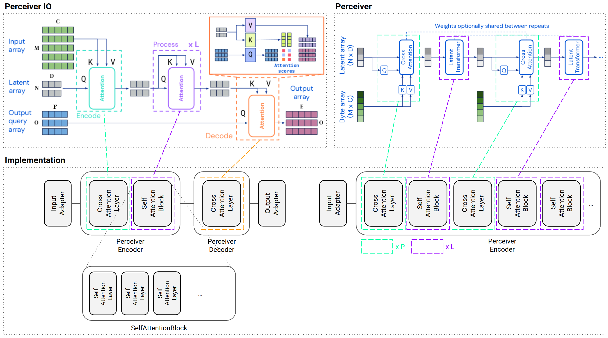
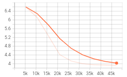
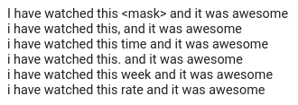
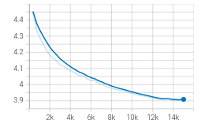
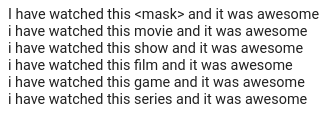
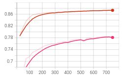
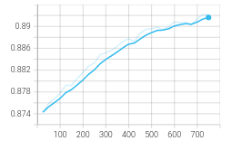
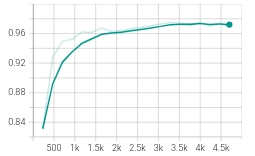

# Perceiver IO

This repository is a PyTorch and [PyTorch Lightning](https://www.pytorchlightning.ai/) implementation of

- [Perceiver IO: A General Architecture for Structured Inputs & Outputs](https://arxiv.org/abs/2107.14795) and
- [Perceiver: General Perception with Iterative Attention](https://arxiv.org/abs/2103.03206)


The codebase is designed for easy extension to new tasks and datasets. If you are a researcher or practitioner working
on new Perceiver IO models and use cases, you might find this repository useful. The integration with PyTorch Lightning
supports model training at any scale. On the other hand, if you are mainly interested in using or fine-tuning models
from the Perceiver IO paper you may want to take a look at the 🤗 [Perceiver IO](https://huggingface.co/docs/transformers/model_doc/perceiver)
implementation.

## Overview

The following figure maps Perceiver IO and Perceiver concepts to the [core modules](perceiver/model/core/modules.py) of
the implementation (see [Architecture](docs/architecture.md) for details).



Interfaces are defined on three levels:

- *PyTorch model API*: defines generic `PerceiverEncoder` and `PerceiverDecoder` classes and task-specific `InputAdapter`
  and `OutputAdapter` subclasses from which PyTorch models can be constructed.
- *PyTorch Lightning model API*: defines wrappers for PyTorch models to support training with the
  [PyTorch Lightning Trainer](https://pytorch-lightning.readthedocs.io/en/stable/common/trainer.html).
- *PyTorch Lightning model CLI*: binds the PyTorch Lightning model API to the command line via the
  [Lightning CLI](https://pytorch-lightning.readthedocs.io/en/stable/common/lightning_cli.html).

Interface usage examples are available for two models from the [Perceiver IO paper](https://arxiv.org/abs/2107.14795):

| Model                                                           | Parameters |                                                              |                                                      |
|-----------------------------------------------------------------|-----------:|--------------------------------------------------------------|------------------------------------------------------|
| Language model (Perceiver IO Base, SentencePiece tokenization)  |       223M | [construction](docs/models/language-model/construction.md)   | [training](docs/models/language-model/training.md)   |
| Image classifier (Perceiver IO config A, 2D Fourier Features)   |      48.4M | [construction](docs/models/image-classifier/construction.md) | [training](docs/models/image-classifier/training.md) |

Training of smaller models is shown in section [Training examples](#training-examples), their usage in section
[Inference examples](#training-examples).

## Installation

### Via pip

```shell
pip install perceiver-io[image,text]
```

### From sources

#### Conda + Poetry

```shell
conda env create -f environment.yml
conda activate perceiver-io
poetry install --all-extras
```

This requires a [Poetry installation](https://python-poetry.org/docs/master/#installation), version 1.2.0b2 or higher.
If running `poetry` fails with a `KeyringError`, refer to the [keyring](https://keyring.readthedocs.io/) documentation
how to [disable keyring](https://keyring.readthedocs.io/en/latest/#disabling-keyring) usage.

#### Docker image

A `perceiver-io` Docker image can be built with:

```shell
docker build -t perceiver-io .
```

Training of Perceiver IO models with this image is described [here](docs/docker.md).

## Training examples

This section uses rather small Perceiver IO models so that the following training examples can be run on limited hardware
resources. Training automatically scales to more than one GPU and was tested on 4 RTX 3080 GPUs. For GPUs with less memory
you may need to reduce the `--data.batch_size` or turn on [activation checkpointing](#activation-checkpointing) for some
of the examples.

Datasets used for model training are 🤗 [Datasets](https://huggingface.co/docs/datasets) wrapped into PyTorch Lightning
data modules (see [data](perceiver/data) package). Datasets are automatically downloaded, preprocessed and cached when
their corresponding Lightning data module is loaded during training. Manual dataset preprocessing is described [here](docs/datasets.md).

An archive with training checkpoints can be downloaded [here](https://martin-krasser.com/perceiver/logs-update-5.zip)
and should be extracted in project's root directory to be compatible with the example command lines below. It also
contains Tensorboard logs and config files.

I didn't really tune hyperparameters, so you'll likely get better results with a bit of experimentation
(see also [training tips](docs/training-tips.md)).

### Masked language modeling

This section trains a very small language model (2.9M parameters) on masked language modeling with whole word masking.
It is first pretrained on [WikiText-103](https://huggingface.co/datasets/wikitext) and then adapted to the [IMDb](https://huggingface.co/datasets/imdb)
dataset. The encoder of the trained language model is then used for [sentiment classification](#sentiment-classification).

The tokenizer is a customized BERT tokenizer (`tokenizers/bert-base-uncased-10k-bookcorpus-ext`), trained on [BookCorpus](https://huggingface.co/datasets/bookcorpus)
with a vocabulary size of 10,000. You can also use any other 🤗 [fast tokenizer](https://huggingface.co/docs/transformers/fast_tokenizers)
from the 🤗 Hub with the `--data.tokenizer` option (see [Tokenizers](docs/tokenizer.md) for details).

The training script is [mlm.py](perceiver/scripts/text/mlm.py). It implements the command line interface and defines
training defaults (see also [trainer.yaml](perceiver/scripts/trainer.yaml) for further defaults). Pretraining on
WikiText-103 can be started with:

```shell
python -m perceiver.scripts.text.mlm fit \
  --model.num_latents=128 \
  --model.num_latent_channels=128 \
  --model.encoder.num_input_channels=128 \
  --model.encoder.num_cross_attention_layers=3 \
  --model.encoder.num_self_attention_layers_per_block=6 \
  --model.encoder.num_self_attention_blocks=3 \
  --model.encoder.first_self_attention_block_shared=false \
  --model.encoder.dropout=0.1 \
  --model.decoder.dropout=0.1 \
  --data=WikiTextDataModule \
  --data.tokenizer=tokenizers/bert-base-uncased-10k-bookcorpus-ext \
  --data.max_seq_len=512 \
  --data.batch_size=64 \
  --optimizer=AdamW \
  --optimizer.lr=1e-3 \
  --optimizer.weight_decay=0.01 \
  --lr_scheduler.warmup_steps=5000 \
  --trainer.accelerator=gpu \
  --trainer.devices=-1 \
  --trainer.max_steps=50000 \
  --trainer.check_val_every_n_epoch=5 \
  --trainer.logger=TensorBoardLogger \
  --trainer.logger.save_dir=logs \
  --trainer.logger.name=mlm
```

| Model parameters                                                                           | Validation loss                           | Mask prediction samples                     |
|--------------------------------------------------------------------------------------------|-------------------------------------------|---------------------------------------------|
| <pre>Total params:      2.9M<br/>Frozen params:       0M<br/>Trainable params:  2.9M</pre> |  |  |

Starting from the best pretraining checkpoint, the language model is then adapted to the IMDb dataset for further 15,000
steps. If you ran pretraining yourself, you'll need to modify the `--model.ckpt` value accordingly, otherwise the checkpoint
from the downloaded archive is used.

```shell
python -m perceiver.scripts.text.mlm fit \
  --model.ckpt="logs/mlm/version_0/checkpoints/epoch=044-val_loss=3.917.ckpt" \
  --model.num_latents=128 \
  --model.num_latent_channels=128 \
  --model.encoder.num_input_channels=128 \
  --model.encoder.num_cross_attention_layers=3 \
  --model.encoder.num_self_attention_layers_per_block=6 \
  --model.encoder.num_self_attention_blocks=3 \
  --model.encoder.first_self_attention_block_shared=false \
  --model.encoder.dropout=0.1 \
  --model.decoder.dropout=0.1 \
  --data=ImdbDataModule \
  --data.tokenizer=tokenizers/bert-base-uncased-10k-bookcorpus-ext \
  --data.max_seq_len=512 \
  --data.batch_size=64 \
  --optimizer=AdamW \
  --optimizer.lr=1e-3 \
  --optimizer.weight_decay=0.01 \
  --lr_scheduler.warmup_steps=1000 \
  --trainer.accelerator=gpu \
  --trainer.devices=-1 \
  --trainer.max_steps=15000 \
  --trainer.check_val_every_n_epoch=3 \
  --trainer.logger=TensorBoardLogger \
  --trainer.logger.save_dir=logs \
  --trainer.logger.name=mlm
```

| Model parameters                                                                           | Validation loss                           | Mask prediction samples                     |
|--------------------------------------------------------------------------------------------|-------------------------------------------|---------------------------------------------|
| <pre>Total params:      2.9M<br/>Frozen params:       0M<br/>Trainable params:  2.9M</pre> |  |  |

After adaption to IMDb, mask prediction samples are obviously more related to movie reviews compared to pretraining on
WikiText-103 only. Prediction samples are screenshots from Tensorboard logs.

### Sentiment classification

This section trains a Perceiver IO text classifier on IMDb reviews. The encoder is initialized with weights from
[masked language modeling](#masked-language-modeling) (`--model.mlm_ckpt` option), the decoder is a randomly initialized
classification decoder. In a first step, only the decoder is trained and the encoder is frozen. The training script is
[classifier.py](perceiver/scripts/text/classifier.py).

```shell
python -m perceiver.scripts.text.classifier fit \
  --model.mlm_ckpt="logs/mlm/version_1/checkpoints/epoch=113-val_loss=3.904.ckpt" \
  --model.num_latents=128 \
  --model.num_latent_channels=128 \
  --model.encoder.num_input_channels=128 \
  --model.encoder.num_cross_attention_layers=3 \
  --model.encoder.num_self_attention_layers_per_block=6 \
  --model.encoder.num_self_attention_blocks=3 \
  --model.encoder.first_self_attention_block_shared=false \
  --model.encoder.dropout=0.1 \
  --model.encoder.freeze=true \
  --model.decoder.num_output_query_channels=128 \
  --model.decoder.dropout=0.1 \
  --data=ImdbDataModule \
  --data.tokenizer=tokenizers/bert-base-uncased-10k-bookcorpus-ext \
  --data.target_task=clf \
  --data.max_seq_len=512 \
  --data.batch_size=256 \
  --optimizer=AdamW \
  --optimizer.lr=1e-4 \
  --optimizer.weight_decay=0.01 \
  --trainer.accelerator=gpu \
  --trainer.devices=-1 \
  --trainer.max_epochs=30 \
  --trainer.log_every_n_steps=10 \
  --trainer.logger=TensorBoardLogger \
  --trainer.logger.save_dir=logs \
  --trainer.logger.name=clf
```

| Model parameters                                                                           | Validation accuracy                     |
|--------------------------------------------------------------------------------------------|-----------------------------------------|
| <pre>Total params:      2.9M<br/>Frozen params:     2.8M<br/>Trainable params:  100K</pre> |  |

The small classification decoder (100K parameters) can be trained to a validation accuracy of 88% when using an
encoder that has been adapted to the IMDb dataset (red line). When using an encoder that has been pretrained on
WikiText-103 only, the validation accuracy saturates at 78% (pink line). Unfreezing the encoder and fine-tuning it
jointly with the classification decoder further improves validation accuracy:

```shell
python -m perceiver.scripts.text.classifier fit \
  --model.clf_ckpt="logs/clf/version_0/checkpoints/epoch=028-val_loss=0.301.ckpt" \
  --model.num_latents=128 \
  --model.num_latent_channels=128 \
  --model.encoder.num_input_channels=128 \
  --model.encoder.num_cross_attention_layers=3 \
  --model.encoder.num_self_attention_layers_per_block=6 \
  --model.encoder.num_self_attention_blocks=3 \
  --model.encoder.first_self_attention_block_shared=false \
  --model.encoder.dropout=0.1 \
  --model.decoder.num_output_query_channels=128 \
  --model.decoder.dropout=0.1 \
  --data=ImdbDataModule \
  --data.tokenizer=tokenizers/bert-base-uncased-10k-bookcorpus-ext \
  --data.target_task=clf \
  --data.max_seq_len=512 \
  --data.batch_size=256 \
  --optimizer=AdamW \
  --optimizer.lr=1e-5 \
  --optimizer.weight_decay=0.01 \
  --trainer.accelerator=gpu \
  --trainer.devices=-1 \
  --trainer.max_epochs=30 \
  --trainer.log_every_n_steps=10 \
  --trainer.logger=TensorBoardLogger \
  --trainer.logger.save_dir=logs \
  --trainer.logger.name=clf
```

| Model parameters                                                                           | Validation accuracy                     |
|--------------------------------------------------------------------------------------------|-----------------------------------------|
| <pre>Total params:      2.9M<br/>Frozen params:       0M<br/>Trainable params:  2.9M</pre> |  |

### Image classification

This section trains a tiny Perceiver IO image classifier (805K parameters) on MNIST digits. The model attends to each
pixel in input images and does not use convolutional layers. In contrast to other examples only a single cross-attention
layer is used. The training script is [classifier.py](perceiver/scripts/image/classifier.py).

```shell
python -m perceiver.scripts.image.classifier fit \
  --model.num_latents=32 \
  --model.num_latent_channels=128 \
  --model.encoder.num_frequency_bands=32 \
  --model.encoder.num_cross_attention_layers=1 \
  --model.encoder.num_self_attention_layers_per_block=3 \
  --model.encoder.num_self_attention_blocks=3 \
  --model.encoder.first_self_attention_block_shared=false \
  --model.encoder.dropout=0.0 \
  --model.encoder.init_scale=0.1 \
  --model.decoder.num_output_query_channels=128 \
  --model.decoder.dropout=0.0 \
  --model.decoder.init_scale=0.1 \
  --data=MNISTDataModule \
  --data.batch_size=128 \
  --optimizer=AdamW \
  --optimizer.lr=1e-3 \
  --optimizer.weight_decay=0.01 \
  --trainer.accelerator=gpu \
  --trainer.devices=-1 \
  --trainer.max_epochs=20 \
  --trainer.logger=TensorBoardLogger \
  --trainer.logger.save_dir=logs \
  --trainer.logger.name=exp
```

| Model parameters                                                                           | Validation accuracy                     |
|--------------------------------------------------------------------------------------------|-----------------------------------------|
| <pre>Total params:      805K<br/>Frozen params:       0K<br/>Trainable params:  805K</pre> |  |

## Inference examples

- Sentiment classification  
  [](https://colab.research.google.com/github/krasserm/perceiver-io/blob/main/notebooks/txt-clf.ipynb)
- Image classification  
  [](https://colab.research.google.com/github/krasserm/perceiver-io/blob/main/notebooks/img-clf.ipynb)
