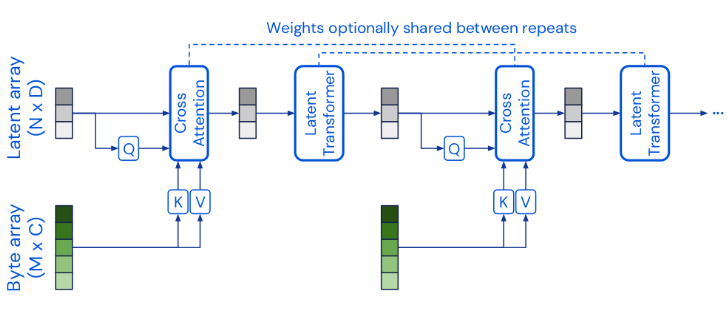
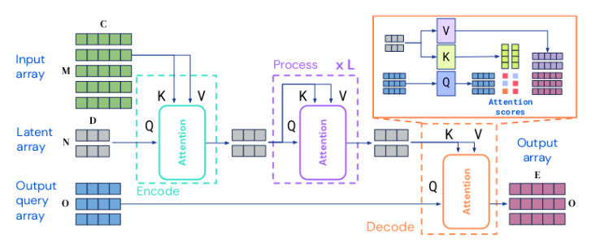
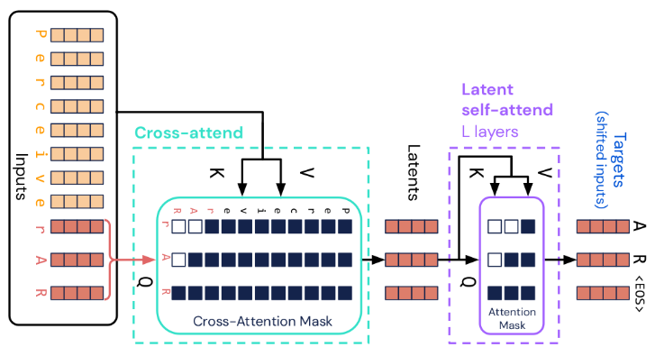

# Perceiver, Perceiver IO and Perceiver AR

This repository is a PyTorch and PyTorch Lightning implementation of

<table>
  <tr>
    <td>
       <b>Perceiver</b>: General Perception with Iterative Attention
       (<a href="https://arxiv.org/abs/2103.03206">paper</a>,
        <a href="https://www.youtube.com/watch?v=P_xeshTnPZg">video</a>)
    </td>
    <td></td>
  </tr>
  <tr>
    <td>
      <b>Perceiver IO</b>: A General Architecture for Structured Inputs & Outputs
      (<a href="https://arxiv.org/abs/2107.14795">paper</a>,
       <a href="https://www.deepmind.com/blog/building-architectures-that-can-handle-the-worlds-data">blog post</a>)
    </td>
    <td></td>
  </tr>
  <tr>
    <td>
      General-purpose, long-context autoregressive modeling with <b>Perceiver AR</b>
      (<a href="https://arxiv.org/abs/2202.07765">paper</a>,
       <a href="https://www.deepmind.com/blog/perceiver-ar-general-purpose-long-context-autoregressive-generation">blog post</a>)
    </td>
    <td></td>
  </tr>
</table>

The codebase is modular and designed for easy extension to new tasks and datasets. The integration with
[PyTorch Lightning](https://pytorch-lightning.readthedocs.io/en/stable/) supports model training at scale. The command
line interface is implemented with the [Lightning CLI](https://pytorch-lightning.readthedocs.io/en/stable/cli/lightning_cli.html).

[Pretrained models](docs/pretrained-models.md) can be imported from the 🤗 Hub. Datasets used for model training
are 🤗 [Datasets](https://huggingface.co/docs/datasets) wrapped into PyTorch Lightning data modules. For NLP tasks,
this library also supports 🤗 [fast tokenizers](https://huggingface.co/docs/transformers/fast_tokenizers) and the
🤗 Perceiver UTF-8 bytes tokenizer.

## Installation

### Via pip

```shell
pip install perceiver-io[image,text]
```

### From sources

Installation from sources requires a [Miniconda](https://docs.conda.io/en/latest/miniconda.html) and a
[Poetry](https://python-poetry.org/docs/#installation) (1.2.0 or higher) installation.

```shell
conda env create -f environment.yml
conda activate perceiver-io
poetry install --all-extras
```

### Docker image

```shell
docker pull ghcr.io/krasserm/perceiver-io:latest
```

See [Docker image](docs/docker-image.md) for details.

## Documentation

- [Pretrained models](docs/pretrained-models.md)
- [Model construction](docs/model-construction.md)
- [Building blocks](docs/building-blocks.md)
- [Training examples](docs/training-examples.md)
- [Inference examples](notebooks/inference_examples.ipynb) [](https://colab.research.google.com/github/krasserm/perceiver-io/blob/main/notebooks/inference_examples.ipynb)

## Getting started

Here's a minimal example for autoregressive language modeling with Perceiver AR. A small language model (30.7M parameters)
is trained on the WikiText-103-raw dataset and then used to generate text from a prompt. Input text is tokenized into
raw UTF-8 bytes, the model also predicts the raw UTF-8 bytes of generated text. More details about Perceiver AR and
Perceiver IO model construction, training and inference are covered in the [documentation](#documentation).

### Training

The command line interface is implemented with [Lightning CLI](https://pytorch-lightning.readthedocs.io/en/stable/cli/lightning_cli.html).
Model training can be started with:

```shell
python -m perceiver.scripts.text.clm fit \
  --model.num_latents=512 \
  --model.num_channels=512 \
  --model.num_self_attention_layers=8 \
  --model.cross_attention_dropout=0.5 \
  --data=WikiTextDataModule \
  --data.tokenizer=deepmind/language-perceiver \
  --data.max_seq_len=4096 \
  --data.batch_size=16 \
  --data.task=clm \
  --optimizer=Adam \
  --optimizer.lr=2e-4 \
  --trainer.max_steps=5000 \
  --trainer.accelerator=gpu \
  --trainer.devices=1 \
  --trainer.accumulate_grad_batches=4
```

You can also do this programmatically with the PyTorch Lightning `Trainer`:

```python
from torch.optim import Adam

from perceiver.data.text.wikitext import WikiTextDataModule, Task
from perceiver.model.text.clm import LitCausalLanguageModel, CausalLanguageModelConfig

import pytorch_lightning as pl


# Lightning WikiText data module
data = WikiTextDataModule(
    tokenizer="deepmind/language-perceiver",
    max_seq_len=4096,
    batch_size=16,
    task=Task.clm,
)

# Language model configuration object
model_config = CausalLanguageModelConfig(
    vocab_size=data.vocab_size,
    max_seq_len=data.max_seq_len,
    num_latents=512,
    num_channels=512,
    num_self_attention_layers=8,
    cross_attention_dropout=0.5,
)

def configure_optimizers(self):
    return Adam(self.parameters(), lr=2e-4)

# Associate optimizer factory with Lightning module (not predefined there)
setattr(LitCausalLanguageModel, "configure_optimizers", configure_optimizers),

# Lightning module of language model (a Perceiver AR)
lit_model = LitCausalLanguageModel.create(model_config)

# Instantiate Lightning Trainer
trainer = pl.Trainer(accelerator="gpu", devices=1, max_steps=5000, accumulate_grad_batches=4)

# Train model (will also preprocess dataset if used for the first time)
trainer.fit(lit_model, datamodule=data)
```

If you instead want to use plain PyTorch (without PyTorch Lightning, except for data sources):

```python
from perceiver.model.text.clm import CausalLanguageModel

import torch.nn.functional as F
from torch.optim import Adam

data = ...
data.prepare_data()
data.setup()

model_config = ...

# Plain PyTorch module of language model
model = CausalLanguageModel(config=model_config)
model.train()

optim = Adam(model.parameters(), lr=2e-4)

# Simplified training loop compared to previous examples
# (no gradient accumulation, epochs instead of max_steps, ...)
for epoch in range(4):
    for labels_ids, input_ids, _ in data.train_dataloader():
        logits = model(input_ids)
        loss = F.cross_entropy(logits.permute(0, 2, 1), labels_ids[:, -model_config.num_latents:])
        loss.backward()
        optim.step()
        optim.zero_grad()
```

### Inference

```python
from perceiver.model.text.clm import LitCausalLanguageModel

data = ...

# Load Lightning module from training checkpoint
lit_model = LitCausalLanguageModel.load_from_checkpoint("/path/to/checkpoint")

# Obtain trained plain PyTorch model
model = lit_model.model.eval()

# Get text preprocessor from data module
preproc = data.text_preprocessor()

# Tokenize a sample prompt
prompt, _ = preproc.preprocess("A man was reading a book on a sunny day until he sudden")

# Generate tokens from prompt via top-k sampling where k = f(vocab_size, threshold)
generated = model.generate(num=512, prompt=prompt[None, ...], threshold=0.9)[0]

# Decode generated tokens
generated_text = data.tokenizer.decode(generated)
```

You can also run text generation interactively in the [Colab notebook](https://colab.research.google.com/github/krasserm/perceiver-io/blob/main/notebooks/inference_examples.ipynb).

## Other implementations

- [Perceiver](https://paperswithcode.com/paper/perceiver-general-perception-with-iterative#code)
- [Perceiver IO](https://paperswithcode.com/paper/perceiver-io-a-general-architecture-for#code)
- [Perceiver AR](https://paperswithcode.com/paper/general-purpose-long-context-autoregressive#code)
