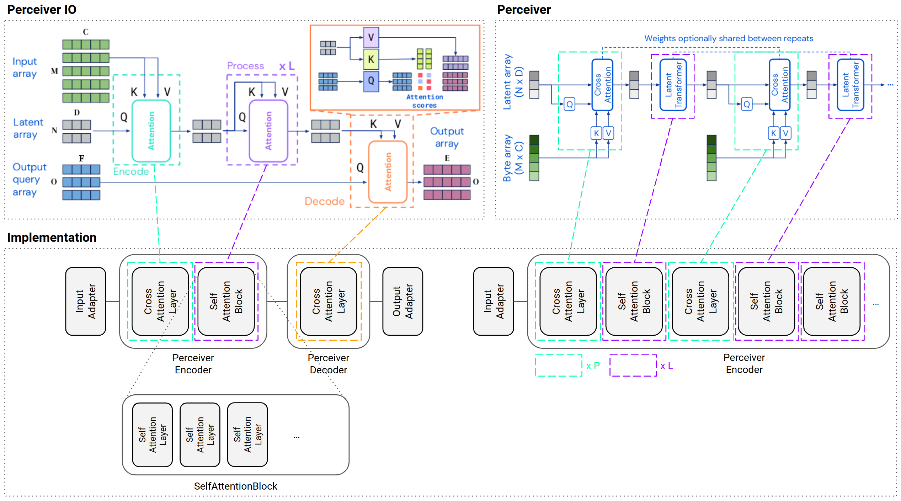

# Perceiver IO

This project is a PyTorch and [PyTorch Lightning](https://www.pytorchlightning.ai/) implementation of

- [Perceiver IO: A General Architecture for Structured Inputs & Outputs](https://arxiv.org/abs/2107.14795) and
- [Perceiver: General Perception with Iterative Attention](https://arxiv.org/abs/2103.03206)

The following figure shows the relation of Perceiver IO and Perceiver concepts to their implementation (see also
[Architecture](docs/architecture.md) for further details).



Generic classes `PerceiverEncoder` and `PerceiverDecoder` and task-specific subclasses of `InputAdapter` and
`OutputAdapter` are part of the [PyTorch model API](docs/interface.md#pytorch-model-api). Models created with this API
are wrapped into modules of the [PyTorch Lightning model API](docs/interface.md#pytorch-lightning-model-api) (not shown)
to support distributed training with the [PyTorch Lightning Trainer](https://pytorch-lightning.readthedocs.io/en/stable/common/trainer.html).
The [PyTorch Lightning model CLI](docs/interface.md#pytorch-lightning-model-cli) provides a flexible command line binding,
implemented with the [Lightning CLI](https://pytorch-lightning.readthedocs.io/en/stable/common/lightning_cli.html).

## Installation

### Via pip

```shell
pip install perceiver-io[image,text]
```

### From sources

```shell
conda env create -f environment.yml
conda activate perceiver-io
poetry install -E image -E text
```

## Datasets

Datasets used in [Tasks](#tasks) are 🤗 [Datasets](https://huggingface.co/docs/datasets) wrapped into PyTorch Lightning
data modules. They must be preprocessed as described in the following subsections:

### English Wikipedia preprocessing

English [Wikipedia](https://huggingface.co/datasets/wikipedia) preprocessing [tokenizes](docs/tokenizer.md) Wikipedia
articles and then concatenates and splits them into chunks of equal size.

```shell
python -m perceiver.scripts.text.dataset preprocess wikipedia \
  --dataset_dir=.cache/wikipedia \
  --tokenizer_file=.cache/sentencepiece-wikipedia.json \
  --output_dir=.cache/wikipedia-preproc \
  --batch_size=10
```

The original dataset is downloaded and cached in `.cache/wikipedia`. The preprocessed dataset is stored in
`.cache/wikipedia-preproc` and can be used for masked language modeling.

### IMDb preprocessing

[IMDb](https://huggingface.co/datasets/imdb) preprocessing [tokenizes](docs/tokenizer.md) IMDb reviews and additionally
concatenates and splits them into chunks of equal size.

```shell
python -m perceiver.scripts.text.dataset preprocess imdb \
  --dataset_dir=.cache/imdb \
  --tokenizer_file=.cache/sentencepiece-wikipedia-ext.json \
  --output_dir=.cache/imdb-preproc \
  --batch_size=500
```

The original dataset is downloaded and cached in `.cache/imdb`. The preprocessed dataset is stored in
`.cache/imdb-preproc` and can be used for masked language modeling and sentiment classification.

### ImageNet preprocessing

[ImageNet](https://huggingface.co/datasets/imagenet-1k) preprocessing ...

```shell
...
```

## Tasks

### Masked language modeling

...

### Sentiment classification

...

### Image classification

...
