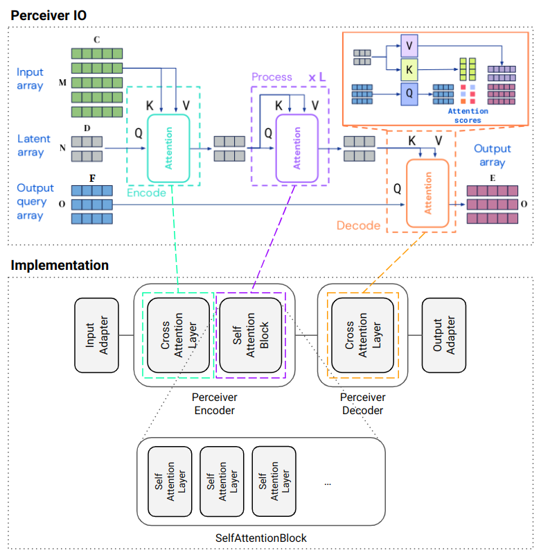
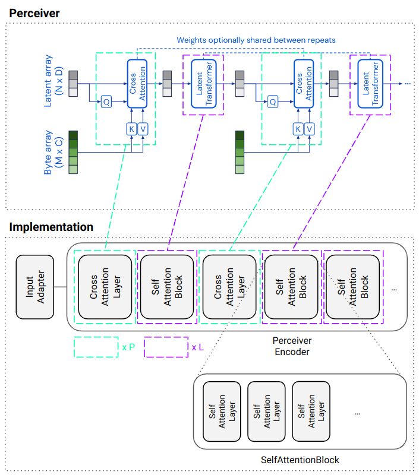
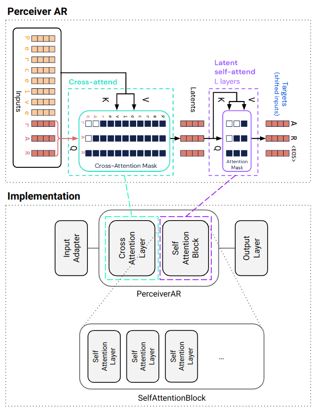

# Building blocks

The following subsections map Perceiver IO and Perceiver concepts to the [core modules](../perceiver/model/core/modules.py)
of this library. Core modules are the building blocks for [model construction](model-construction.md).

## Perceiver IO

Perceiver IO models are constructed from generic `PerceiverEncoder` and `PerceiverDecoder` classes and task-specific
`InputAdapter` and `OutputAdapter` subclasses. Array dimensions (`M`, `C`), (`N`, `D`), (`O`, `F`)  and (`O`, `E`)
have the following names in code and/or on the command line (see also code comments [here](model-construction.md#perceiver-io)):

| Array dimension | Configuration parameter name                                                    |
|-----------------|---------------------------------------------------------------------------------|
| `M`             | Input-specific name (e.g. `max_seq_len` for text input, ...)                    |
| `C`             | `num_input_channels` (property of `InputAdapter`)                               |
| `N`             | `num_latents`                                                                   |
| `D`             | `num_latent_channels`                                                           |
| `O`             | Output-specific name (e.g. `num_output_queries` for classification output, ...) |
| `E`             | Output-specific name (e.g. `num_classes` for classification output, ...)        |
| `F`             | `num_output_query_channels` (property of `OutputAdapter`)                       |

The number of layers in a `SelfAttentionBlock` can be specified with `num_self_attention_layers_per_block` and the
number of blocks with `num_self_attention_blocks` (`L`). By specification, [Perceiver IO](https://arxiv.org/abs/2107.14795)
does not use repeated encoder cross-attention:

> We omit the repeated encoder cross-attends used in [Perceiver](https://arxiv.org/abs/2103.03206) as we found these to
> lead to relatively small performance improvements but to significantly slow down training ...

This may be the case for the very large datasets as used in the Perceiver IO paper, but I found that repeated encoder
cross-attention actually gives better training results for smaller datasets. Therefore, the implementation also
supports repeated encoder cross-attention as described in the [next section](#perceiver).

## Perceiver

Perceiver models are constructed from `PerceiverEncoder` classes and a task-specific `InputAdapter` subclass. The output
is averaged over dimension `N` and projected to the number of target classes (not part of the library).  

The number of repeated cross-attentions can be specified with `num_cross_attention_layers` (`P`) which must be less
than or equal `num_self_attention_blocks` (`L`). Cross-attention layers 2 - `P` and self-attention blocks 2 - `L`
always share their weights. Sharing the weights with the first cross-attention layer can be configured with
`first_cross_attention_layer_shared`, sharing the weights with the first self-attention block can be configured with
`first_self_attention_block_shared`. The default values of these configuration parameters are consistent with the
Perceiver IO architecture (1 cross-attention layer, `L` self-attention blocks with weight sharing).

## Perceiver AR

The implementation of [Perceiver AR](https://arxiv.org/abs/2202.07765) is very similar to a Perceiver IO encoder.
Perceiver AR additionally uses [rotary position embeddings](https://arxiv.org/abs/2104.09864) and uses a causal
cross- and self- attention mask. The current implementation is still experimental and a final implementation may
be entirely based on Perceiver IO.
