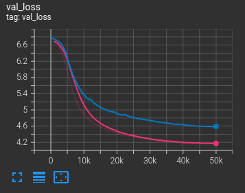

## Activation checkpointing

[Activation checkpointing](https://pytorch-lightning.readthedocs.io/en/latest/advanced/advanced_gpu.html#fairscale-activation-checkpointing)
can be enabled with `--model.activation_checkpoint=true`. This implements activation checkpoints for each self-attention
and cross-attention layer and saves GPU memory during training. For example, the saved GPU memory can be used to run
[masked language modeling](../README.md#masked-language-modeling) with a higher number of latent channels (`256`
instead of `64`).

```shell
python scripts/mlm.py fit \
  --model.activation_checkpoint=true \
  --model.num_latent_channels=256 \
  --model.encoder.num_layers=3 \
  --model.encoder.dropout=0.0 \
  --model.decoder.dropout=0.0 \
  --data=IMDBDataModule \
  --data.max_seq_len=512 \
  --data.batch_size=64 \
  --optimizer.lr=0.002 \
  --optimizer.weight_decay=0.05 \
  --lr_scheduler.pct_start=0.1 \
  --trainer.accelerator=gpu \
  --trainer.devices=-1 \
  --trainer.max_steps=50000 \
  --trainer.check_val_every_n_epoch=5 \
  --trainer.strategy=ddp_static_graph
```

The following figure compares the validation losses for `64` latent channels (blue line) and `256` latent channels
(red line), demonstrating a performance improvement by increasing the number of latent channels.



If `--model.num_encoder_layers` is greater than `2`, the option `--trainer.strategy=ddp_static_graph` must be used in
order to support checkpointing of shared layers 2-n.
